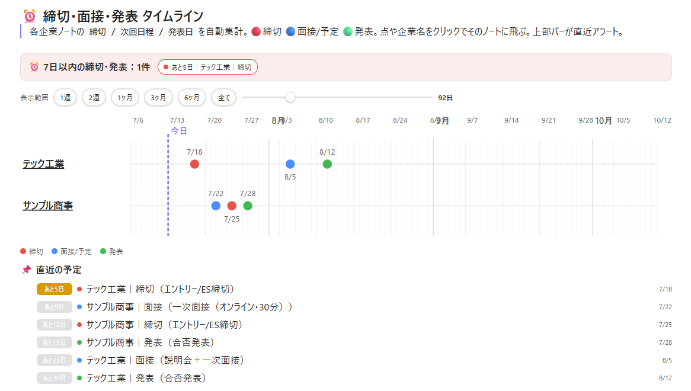

# 就活タイムライン (Shukatsu Timeline) for Obsidian

就活（就職活動）の **締切・面接・発表日** を、企業ノートのプロパティから自動集計して
**ガントチャート風の横軸タイムライン**で可視化する Obsidian プラグインです。
さらに **7日以内の締切/発表を起動時に通知** する締切アラート機能つき。

> An Obsidian plugin that visualizes Japanese job-hunting (_shukatsu_) schedules —
> application deadlines, interviews, and result-announcement dates — on a horizontal
> Gantt-style timeline, aggregated automatically from your company notes' properties.
> It also raises a deadline alert for anything due within 7 days.



> スクリーンショットは `docs/screenshot.png` に差し替えてください（未同梱）。

---

## ✨ 特徴

- 📅 **横軸タイムライン**：各企業の `締切 / 次回日程 / 発表日` を1本の時間軸に並べて表示。「今日」ラインつき。
- 🔴🔵🟢 **種別で色分け**：締切=赤 / 面接・予定=青 / 発表=緑。
- ⏰ **締切アラート**：起動時に7日以内の締切・発表をポップアップ通知。ステータスバーにも常時表示。
- 🖱 **クリックで即ジャンプ**：点や企業名をクリックすると該当ノートを開く。
- 📌 **直近の予定リスト**：残り日数バッジ（あと3日 など）つきで下部に一覧。
- 🧮 **設定ファイル不要**：フォルダ内の企業ノートを自動スキャン。コードブロックのオプションだけで調整。
- 🌗 **ライト/ダーク両対応**：テーマのCSS変数に追従。

## 📦 インストール

### 手動インストール
1. [Releases](../../releases) から `main.js` と `manifest.json` をダウンロード。
2. Vault の `.obsidian/plugins/shukatsu-timeline/` フォルダに置く。
3. Obsidian の **設定 → コミュニティプラグイン** で「就活タイムライン」を有効化。

### BRAT（ベータ配布）
[BRAT](https://github.com/TfTHacker/obsidian42-brat) で `TaktoSasaki/obsidian-shukatsu-timeline` を追加してもインストールできます。

## 🚀 使い方

### 1. 企業ノートを用意する
`就活/企業/` のようなフォルダに、企業ごとのノートを作り、フロントマターに日付プロパティを入れます。

```yaml
---
type: 企業            # 任意。指定するとこの値のノートだけ集計対象になる
会社名: サンプル商事    # 省略時はファイル名を会社名として使う
選考状況: 一次面接      # 内定 / お祈り / 辞退 はアラート対象外になる
締切: 2026-07-25       # 🔴 締切
次回日程: 2026-07-22    # 🔵 面接/予定
次回内容: 一次面接      # 🔵 のラベルに使われる
発表日: 2026-07-28     # 🟢 合否発表
---
```

### 2. 総合ページにコードブロックを置く
表示したいノート（就活の総合ページなど）に、次のコードブロックを書きます。

````markdown
```shukatsu-timeline
folder: 就活/企業
past: 7
future: 120
alert: 7
```
````

これでタイムライン・アラートバー・直近の予定リストが描画されます。

## ⚙️ オプション

コードブロック内に `キー: 値` の形式で記述します。すべて省略可能です。

| キー | 既定値 | 説明 |
|---|---|---|
| `folder` | `就活/企業` | 集計対象の企業ノートが入っているフォルダ |
| `past` | `7` | 今日より何日前まで軸に表示するか |
| `future` | `120` | 今日より何日先まで軸に表示するか（イベントがもっと先ならそこまで自動拡張） |
| `alert` | `7` | 上部アラートバーで「直近」とみなす日数 |

## 🏷 読み取るプロパティ

| プロパティ | 種別 | 色 |
|---|---|---|
| `締切` | 締切 | 🔴 赤 |
| `次回日程`（`次回内容`をラベルに使用） | 面接/予定 | 🔵 青 |
| `発表日` | 発表 | 🟢 緑 |
| `会社名` | 行のラベル（無ければファイル名） | — |
| `選考状況` | `内定/お祈り/辞退` はアラート対象外・点を淡色化 | — |
| `type` | `企業` のときだけ集計（プロパティ自体が無ければ全ノート対象） | — |

## ⏰ アラート機能

- **起動時通知**：Vault起動時、`alert` 日以内（既定7日）の締切・発表があればNoticeで通知。
- **ステータスバー**：画面下部に `⏰ 就活 2件 (最短 あと3日)` を常時表示。クリックで再通知。
- **コマンド**：コマンドパレット →「就活：直近の締切/発表をアラート表示」でいつでも確認。
- 完了案件（選考状況が `内定 / お祈り / 辞退`）はアラートから自動除外されます。

## 🛠 開発

このプラグインはビルド不要のプレーンJavaScript（`main.js`）です。編集後は Obsidian を再読み込み（またはプラグインを無効化→有効化）すれば反映されます。

```
main.js         … 本体
manifest.json   … プラグイン定義
versions.json   … バージョン対応表
```

## 📄 ライセンス

[MIT](LICENSE) © TakutoSasaki
